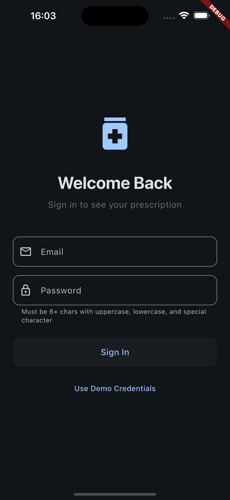
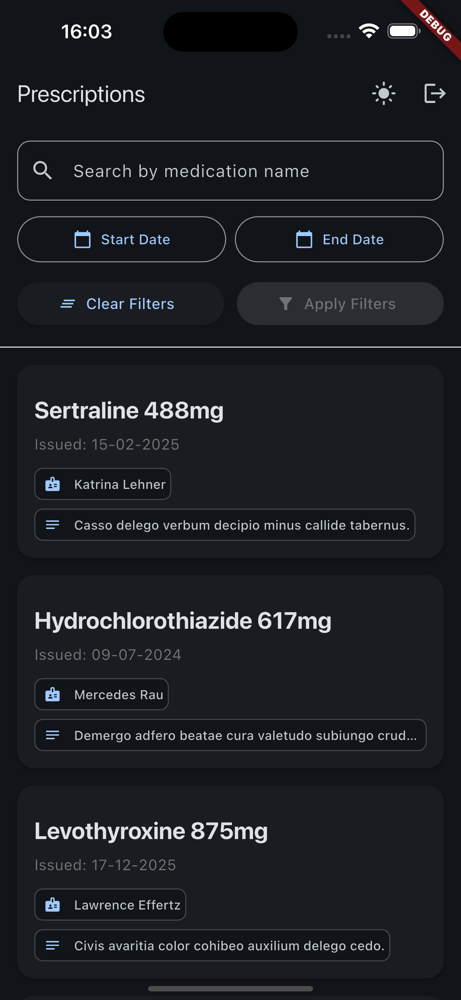
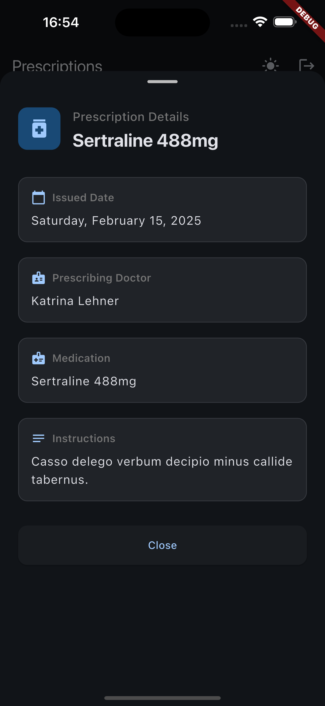
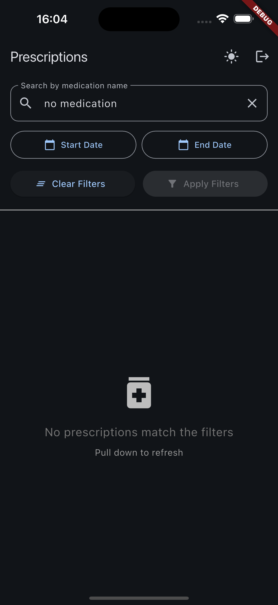
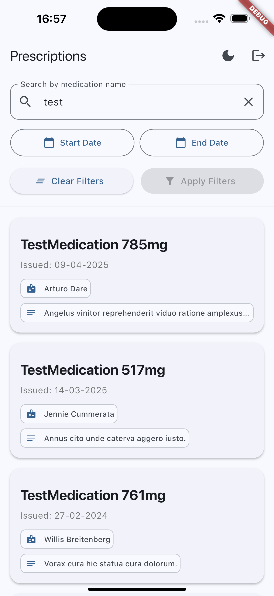
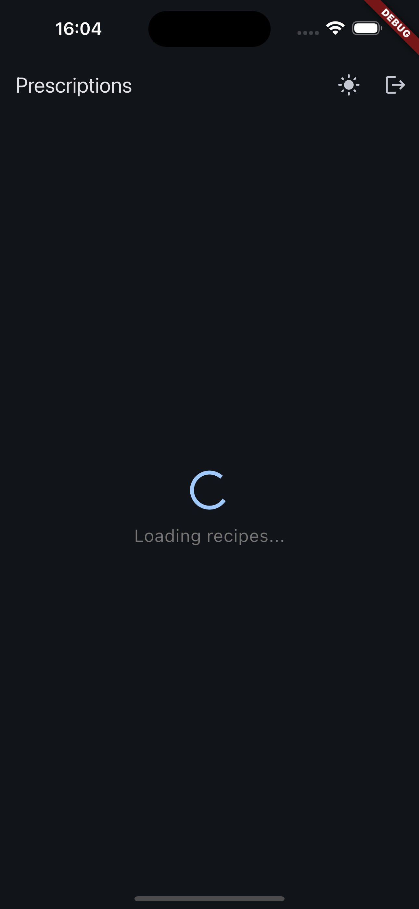
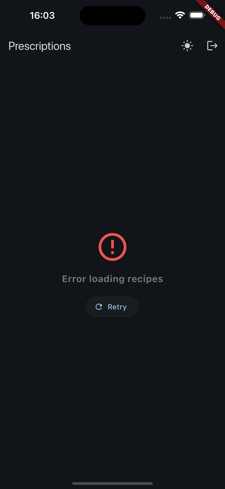

# Aplicación de Recetas Médicas

Aplicación Flutter para gestionar prescripciones médicas con autenticación de Firebase, integración con API paginada y una interfaz moderna basada en Material Design 3.

## Funcionalidades

- 🔐 **Autenticación Firebase**: Inicio de sesión con correo y contraseña, almacenamiento seguro del token
- 💊 **Recetas Médicas**: Consulta y gestión de prescripciones clínicas
- 🔍 **Filtro Avanzado**: Búsqueda por nombre del medicamento y rango de fechas
- 📄 **Paginación Infinita**: Carga automática de páginas al desplazarse
- 🎨 **Tema Claro/Oscuro**: Conmutador con preferencia persistente
- 📱 **Pull-to-Refresh**: Actualiza los datos con un gesto de arrastre
- 🔒 **Llamadas a API Seguras**: Peticiones autenticadas con ID tokens de Firebase
- 📊 **Vista Detallada**: Modal con información completa de cada receta
- ✅ **Pruebas Completas**: 28 tests unitarios que cubren la funcionalidad principal

## Arquitectura

Basada en **Clean Architecture** con una estructura de carpetas orientada por funcionalidades:

```
lib/
├── main.dart                          # App entry point with Firebase & theme setup
├── firebase_options.dart              # Firebase configuration (auto-generated)
├── core/
│   └── theme/
│       ├── app_theme.dart            # Light/dark theme definitions
│       └── theme_provider.dart       # Theme state management
└── features/
    ├── auth/                         # Authentication feature
    │   ├── domain/
    │   │   └── user.dart            # User model
    │   ├── application/
    │   │   └── auth_provider.dart   # Auth state & Firebase integration
    │   └── presentation/
    │       └── login_screen.dart    # Login UI with validation
    └── recipes/                      # Prescriptions feature
        ├── domain/
        │   ├── recipe.dart          # Recipe model
        │   └── recipe_filters.dart  # Filter value object
        ├── data/
        │   └── recipe_api_service.dart # API client with pagination
        ├── application/
        │   └── recipes_provider.dart   # State management & pagination
        └── presentation/
            ├── recipes_list_screen.dart # Main list screen
            └── widgets/
                ├── recipe_card.dart        # Recipe card component
                ├── recipe_details_modal.dart # Detail view modal
                └── recipe_filter_section.dart # Filter UI
```

## Stack Tecnológico

- **Flutter SDK**: 3.35.7
- **State Management**: Riverpod (2.6.1)
- **Routing**: GoRouter (14.8.1)
- **Backend**: Firebase (Auth, Core)
- **Networking**: Cliente HTTP con autenticación Bearer
- **Seguridad**: Flutter Secure Storage para persistencia del token
- **Tema**: SharedPreferences para guardar la preferencia

## Primeros Pasos

### Requisitos Previos

- Flutter SDK 3.9.2 o superior
- Proyecto de Firebase con Authentication habilitado
- Endpoint de API backend (opcional: puede usarse el modo mock)

### Instalación

1. **Clonar e instalar dependencias**:

```bash
cd recepies_app
flutter pub get
```

2. **Configuración iOS** (si se ejecuta en iOS):

```bash
cd ios
pod install
cd ..
```

3. **Configurar Firebase** (ya incluido en el repositorio):

   - Android: `android/app/google-services.json` ✓
   - iOS: `ios/Runner/GoogleService-Info.plist` ✓
   - macOS: `macos/Runner/GoogleService-Info.plist` ✓

4. **Ejecutar la aplicación**:

```bash
# Default (with current settings)
flutter run

# With custom API endpoint
flutter run --dart-define=API_BASE_URL=https://your-api.com --dart-define=USE_MOCK_DATA=false

# With mock data
flutter run --dart-define=USE_MOCK_DATA=true
```

## Configuración

### Variables de Entorno

La app admite variables de entorno en tiempo de compilación para adaptar la configuración en distintos entornos:

#### Configuración Backend

- `API_BASE_URL`: Endpoint del backend (por defecto `http://localhost:3000`)
- `USE_MOCK_DATA`: Usa datos mock locales en lugar de llamar al API (por defecto `false`)

#### Credenciales Demo (Opcional)

- `DEMO_EMAIL`: Correo para el botón “Use Demo Credentials”
- `DEMO_PASSWORD`: Contraseña para el botón “Use Demo Credentials”

**Nota**: El botón de credenciales demo solo aparece cuando se definen ambas variables. Así evitamos exponer credenciales en producción y facilitamos las pruebas en desarrollo.

**Ejemplos**:

```bash
# Production (no demo button)
flutter run \
  --dart-define=API_BASE_URL=https://api.yourcompany.com \
  --dart-define=USE_MOCK_DATA=false

# Development with demo credentials
flutter run \
  --dart-define=USE_MOCK_DATA=true \
  --dart-define=DEMO_EMAIL=demo@example.com \
  --dart-define=DEMO_PASSWORD=Test12!

```

### Modo Mock

Cuando `USE_MOCK_DATA=true`, la app carga recetas desde `assets/mock_recipes.json` en lugar de llamar al API. Ideal para:

- Desarrollo sin conexión
- Pruebas de UI
- Demos rápidas

## Integración con la API

### Endpoints Esperados

#### GET /recipes

**Parámetros de consulta**:

- `medicationName` (string, opcional): Filtra por nombre del medicamento
- `startDate` (YYYY-MM-DD, opcional): Filtra a partir de esta fecha
- `endDate` (YYYY-MM-DD, opcional): Filtra hasta esta fecha
- `page` (int, requerido): Número de página (base 1)
- `limit` (int, requerido): Elementos por página

**Encabezados**:

- `Content-Type: application/json`
- `Authorization: Bearer <firebase_id_token>`

**Respuesta esperada**:

```json
{
  "data": [
    {
      "id": "uuid",
      "patientId": "uuid",
      "medication": "string",
      "issuedAt": "2023-06-01T00:00:00.000Z",
      "doctor": "string",
      "notes": "string"
    }
  ],
  "total": 200,
  "page": 1,
  "limit": 10,
  "totalPages": 10
}
```

### Verificación de Token Firebase (Backend)

El backend debe validar los ID tokens de Firebase usando el SDK Admin.

**Ejemplo en Node.js**:

```javascript
const admin = require('firebase-admin');
admin.initializeApp({ credential: admin.credential.cert(serviceAccount) });

app.use(async (req, res, next) => {
  const token = req.headers.authorization?.split('Bearer ')[1];
  try {
    const decodedToken = await admin.auth().verifyIdToken(token);
    req.user = decodedToken;
    next();
  } catch (error) {
    res.status(401).json({ message: 'Invalid token' });
  }
});
```

## Uso

### Inicio de Sesión

1. Introducir correo (formato `string@string.string`)
2. Introducir contraseña (requisitos):
   - Mínimo 6 caracteres
   - Una letra mayúscula
   - Una letra minúscula
   - Un carácter especial (!@#$%^&\*(),.?":{}|<>)
3. Pulsar “Sign In” o “Use Demo Credentials”
4. Firebase autentica y almacena el token de forma segura

### Lista de Recetas

**Características**:

- **Búsqueda**: Filtra por nombre del medicamento
- **Rango de Fechas**: Selecciona fecha inicial y final
- **Aplicar Filtros**: Botón que dispara la petición filtrada al API
- **Limpiar Filtros**: Restablece filtros y recarga datos
- **Scroll Infinito**: Carga la siguiente página al llegar al final
- **Pull-to-Refresh**: Arrastre hacia abajo para refrescar
- **Modal de Detalle**: Toca una receta para ver toda la información
- **Modo Oscuro**: Conmutador con preferencia persistente

**Flujo de Filtros**:

1. Escribe el nombre del medicamento y selecciona las fechas
2. Pulsa “Apply Filters” → se envía la petición con los parámetros
3. Los resultados se cargan con soporte de paginación
4. Desplázate hacia abajo → se carga automáticamente la siguiente página
5. Arrastra hacia abajo → se refrescan los datos con los filtros vigentes

## Modelos de Datos

### Recipe (Receta Médica)

```dart
class Recipe {
  final String id;
  final String patientId;
  final String medication;
  final DateTime issuedAt;
  final String doctor;
  final String notes;
}
```

### User

```dart
class User {
  final String id;
  final String email;
}
```

## Gestión de Estado

### Authentication (`authProvider`)

- Controla el estado de autenticación de Firebase
- Guarda los ID tokens en almacenamiento seguro
- Sincroniza con los cambios de sesión
- Gestiona login y logout

### Recipes Pagination (`recipesPaginationProvider`)

- Administra la lista paginada de recetas
- Controla el scroll infinito
- Aplica filtros en el servidor
- Gestiona los estados de carga (inicial, carga adicional, error)

### Theme (`themeProvider`)

- Gestiona el modo claro/oscuro
- Persiste la preferencia utilizando SharedPreferences

## Pruebas

Ejecutar la suite de tests:

```bash
# All tests
flutter test

# Specific test file
flutter test test/domain/recipe_test.dart

# With coverage
flutter test --coverage
```

**Cobertura**: 28 tests exitosos

- Modelos de dominio (5)
- Validación de email/contraseña (14)
- Lógica de filtrado por fecha (7)
- Flujo de recetas (4)

Consulta `test/README.md` para más detalles.

## Dependencias Principales

```yaml
dependencies:
  flutter_riverpod: ^2.6.1 # State management
  go_router: ^14.2.7 # Routing
  firebase_core: ^3.6.0 # Firebase core
  firebase_auth: ^5.3.1 # Firebase authentication
  flutter_secure_storage: ^9.2.2 # Secure token storage
  intl: ^0.19.0 # Date formatting
  http: ^1.2.0 # API calls
  shared_preferences: ^2.2.0 # Theme persistence
```

## Desarrollo

### Logging de Depuración

La app genera logs detallados:

**Autenticación**:

- Intentos de login
- Respuestas de Firebase
- Operaciones de almacenamiento del token
- Cambios de estado autenticado/no autenticado

**Peticiones API**:

- Modo de la petición (mock/API real)
- Parámetros enviados
- Encabezados (incluyendo token)
- Código de respuesta y cuerpo
- Información de paginación

Revisa la consola de depuración durante el desarrollo.

### Calidad de Código

- ✅ Sin errores de linter
- ✅ Arquitectura basada en features
- ✅ Separación por capas (dominio/datos/aplicación/presentación)
- ✅ Manejo completo de errores
- ✅ Verificaciones `mounted` en operaciones asíncronas
- ✅ Liberación correcta de recursos

## Construcción para Producción

### Android

```bash
# Production build (no demo button)
flutter build apk --release \
  --dart-define=API_BASE_URL=https://your-api.com \
  --dart-define=USE_MOCK_DATA=false

# Staging build (with demo button)
flutter build apk --release \
  --dart-define=API_BASE_URL=https://staging-api.com \
  --dart-define=USE_MOCK_DATA=false \
  --dart-define=DEMO_EMAIL=demo@example.com \
  --dart-define=DEMO_PASSWORD=Test123!
```

### iOS

```bash
# Production build (no demo button)
flutter build ios --release \
  --dart-define=API_BASE_URL=https://your-api.com \
  --dart-define=USE_MOCK_DATA=false

# Staging build (with demo button)
flutter build ios --release \
  --dart-define=API_BASE_URL=https://staging-api.com \
  --dart-define=USE_MOCK_DATA=false \
  --dart-define=DEMO_EMAIL=demo@example.com \
  --dart-define=DEMO_PASSWORD=Test123!
```

### Web

```bash
# Production build (no demo button)
flutter build web --release \
  --dart-define=API_BASE_URL=https://your-api.com \
  --dart-define=USE_MOCK_DATA=false
```

## Solución de Problemas

### Autenticación Firebase

1. Verifica que Firebase Authentication esté habilitado en la consola
2. Crea usuarios de prueba en Firebase Console → Authentication → Users
3. Asegúrate de que `firebase_options.dart` corresponda a tu proyecto

### Conexión con el API

1. Revisa la variable `API_BASE_URL`
2. Comprueba que el backend esté operativo y accesible
3. Valida que el backend verifique los tokens de Firebase
4. Consulta los logs de depuración para más detalles

### Errores con el Llavero iOS

La app maneja duplicados del llavero. Si persisten los problemas:

1. Borra los datos de la app o reinstálala
2. Verifica la configuración de `auth_provider.dart`

## Buenas Prácticas de Seguridad

### Archivos de Configuración Firebase

Los siguientes archivos contienen claves públicas y es seguro versionarlos:

- ✅ `lib/firebase_options.dart`
- ✅ `ios/Runner/GoogleService-Info.plist`
- ✅ `android/app/google-services.json`

La seguridad se garantiza mediante:

1. Reglas de seguridad de Firebase
2. Verificación de tokens en el backend
3. Firebase App Check (recomendado)

### Qué Mantener Privado

❌ **No subir nunca**:

- Claves de servicio del SDK Admin (`serviceAccountKey.json`)
- Archivos `.env` del backend
- Certificados privados
- Credenciales demo de producción

### Credenciales Demo

**Desarrollo/Staging**:

```bash
# Pasar por línea de comandos
flutter run --dart-define=DEMO_EMAIL=demo@test.com --dart-define=DEMO_PASSWORD=Test123!
```

**Producción**:

- No definir `DEMO_EMAIL` ni `DEMO_PASSWORD`
- El botón de demo no aparecerá
- Se requieren cuentas válidas de Firebase

### Recomendaciones

1. Configura reglas de seguridad en Firestore/Storage
2. Valida los ID tokens en tu backend (ya implementado)
3. Activa Firebase App Check como capa adicional
4. Usa proyectos distintos de Firebase para dev/staging/prod
5. Nunca incluyas credenciales en el código fuente

## Licencia

Proyecto privado, no publicado en pub.dev.

## Imagenes

<p align="center">
  
  
  
  
  
  
  
</p>
